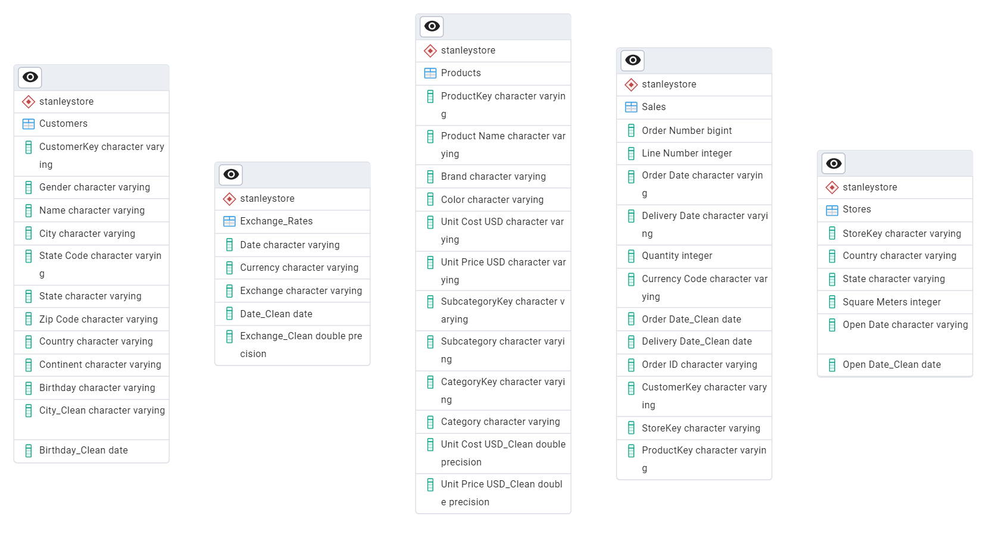

# Stanley-Electronics-Analysis

# Project Background
Stanley Electronics, established in 2016 is a global electronics retailer who has a both online and offline presence in 8 countries across continents.
Over the years the company has amassed significant amounts of data but they’ve not harnessed it to unearth value. This project thoroughly synthesises the data to unveil critical insights that will improve Stanley’s commercial success while helping them remain competitive.
Insights and recommendations are provided on the following key areas:
1.	Sales Performance: Evaluation of historical sales patterns both globally and by region focusing on revenue, profits and order volume
2.	Products level performance: Analysis of various product lines along with categories and subcategories, understanding their impact on sales and profits
3.	Customer segmentation: Insights on customer buying patterns by age, gender and region
4.	Stores performance: Analysis of stores based on their age, size and region 

SQL queries were used to inspect and clean the data for this analysis.

# Data Structure & Initial Checks
The company’s main database structure as seen below consists of 5 tables: Sales, Customers, Products, Stores and Exchange Rates.

# Executive Summary
Overview of Findings
The sales have been growing at less that 2% over the last 2 years with a significant portion of revenue being generated by a small set of high-margin products, mainly in the Audio and Computing categories. The following sections will explore additional contributing factors and highlight key opportunity areas for improvement.
Below is the overview page from the PowerBI dashboard and more examples are included throughout the report. The entire interactive dashboard can be downloaded from here.

 
# Insights Deep Dive
Sales Performance: 
1.	Monthly Revenue Trends: Sales peak consistently around Q4, likely driven by holiday and promotional periods.
2.	Currency Volatility: Transactions in GBP and EUR have notable revenue fluctuations due to currency exchange rate impacts.
3.	Order Volume vs. Revenue: While order volume is stable across time, revenue varies more—indicating product mix shifts or pricing effects.

 
Product Level Performance:
1.	Top Categories: The Computers and Home Appliances categories account for over 60% of total revenue.
2.	High-Performing Products: Specific models in Contoso's MP3 Player line have outsized revenue contributions due to strong volume and price.
3.	Price vs. Cost Margins: Products generally maintain a margin above 50%, especially in accessories and smaller electronics.
4.	Underperformers: Products in Accessories and Software categories show high volume but lower revenue contributions, suggesting bundling or promotional use.

 
Customer Segmentation:
1.	Age Segmentation: Customers aged 45+ contribute the most to revenue, followed by the 25–34 age group.
2.	Gender Neutrality: No strong skew in purchasing between male and female customers; spending is evenly distributed.
3.	Repeat Buyers: Approximately 30% of customers are repeat purchasers, with significantly higher average order values.
4.	Buying Frequency: Customers aged 18-34 buy more frequently than other age groups and all customers mostly prefer buying in offline stores

 
Store Performance:
1.	Revenue by Size: Stores with more than 1,000 sq meters generate nearly double the revenue per store compared to smaller outlets.
2.	Best Performing Locations: Stores in Canada and United States lead in overall sales.
3.	Store Age Effect: Stores open for more than 10 years consistently perform better, suggesting local brand maturity drives sales.

 
# Recommendations:
Based on the insights and findings above, it is recommended that Stanley’s teams to consider the following:
1.	Focus on High-Margin Products: Invest in marketing and inventory of best-selling products in computers and home appliances categories.
2.	Expand Successful Stores: Consider upsizing or replicating successful large-format stores in high-performing regions.
3.	Enhance Customer Loyalty: Introduce loyalty programs to incentivize repeat purchases, especially for the 18-34 demographic.
4.	Strengthen Online Channel: There is scope to further develop the e-commerce platform, including targeted promotions based on geography and age segmentation to increase sales overall.

# Assumptions and Caveats:
Throughout the analysis, multiple assumptions were made to manage challenges with the data. These assumptions and caveats are noted below:
1. Assumption 1: missing country records were for customers based in the US, and were re-coded to be US citizens
2. Assumption 2: customer birthdates were all assumed to be in mm/dd/yyyy formats despite the countries they belonged to.
3. Assumption 3:  because 3% of the order date date column contained non-sensical dates, these were excluded from the analysis
